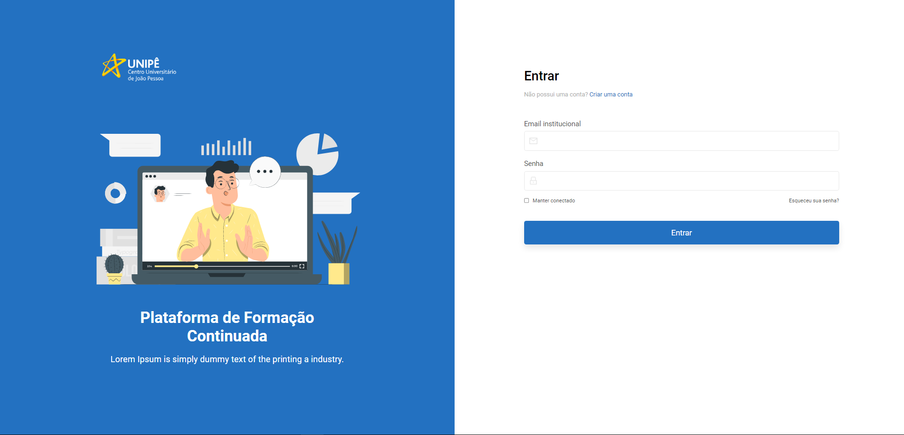

# Formação Continuada

<br/>

<p align="center">
  
</p>

## Instalação:

```bash
# Backend
pip install -r requirements.txt
# Frontend
npm install
```

## Inicialização:

```bash
# Backend
$ py manage.py runserver
# Frontend
$ npm start
```

## Observações:

- O projeto é para ser rodado em dois terminais diferentes, um terminal será para o back-end, e outro para o front-end, a inicialização de ambos foi especificada acima.

* Ao inicializar o projeto, atente-se ao diretório que estará sendo inicializado, exemplo, o front-end deverá ser inicializado pela pasta reactapp, e o back-end é pela pasta Back-end.

* As páginas devem ser trocadas pela URL, por exemplo: caso esteja na página inicial(http://localhost:3000/) e queira trocar para a página de register, é necessário digitar /register na URL, da seguinte forma: http://localhost:3000/register.
